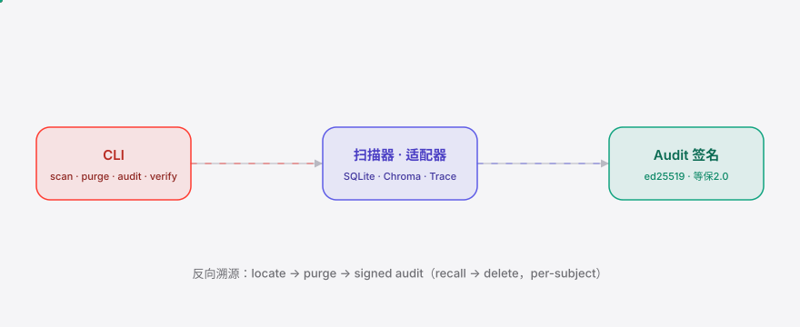
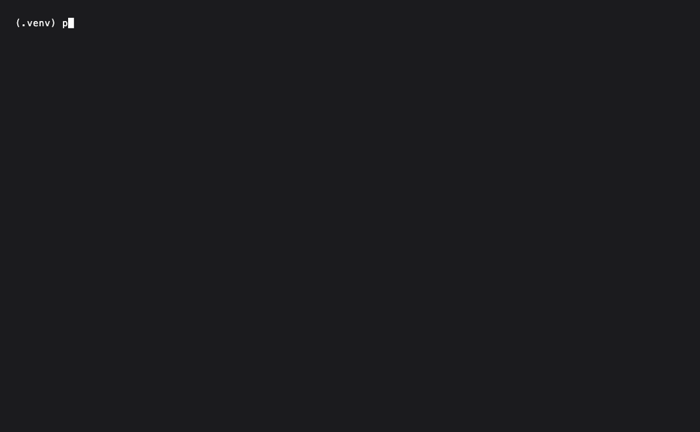

<div align="right"><sub><b>English</b>&nbsp;&nbsp;⇄&nbsp;&nbsp;<a href="./README.md">简体中文</a></sub></div>

<picture>
  <source media="(prefers-color-scheme: dark)" srcset="./assets/hero-dark.svg">
  <source media="(prefers-color-scheme: light)" srcset="./assets/hero-light.svg">
  
</picture>

<p align="center"><sub>The deletion-lineage mapper that locates and purges one person's PII across agent-memory stores, fully on-prem.</sub></p>

<p align="center">
  <a href="./LICENSE"></a>
  
  
  
  
  
</p>

> **A deletion request lands, and the subject's PII is scattered across 7 places in your agent memory — SubjectPurge locates it in 30s, deletes it with a traceable lineage, and issues a signed audit proof, all without your data leaving the premises.**

<h2> Architecture</h2>

<picture>
  <source media="(prefers-color-scheme: dark)" srcset="./assets/atlas-dark.svg">
  <source media="(prefers-color-scheme: light)" srcset="./assets/atlas-light.svg">
  
</picture>

One process. Adapters are in-process plugins implementing `locate(subject) -> [ResidueHit]`
(and, at m2, `purge(hit)`). The scanner fans out to every registered store, merges the results
into `residue_map.json`; the purger deletes per hit and writes the hash-chained `lineage.jsonl`;
the audit signer issues an ed25519-signed 等保2.0 (MLPS 2.0) proof. The optional LLM
(Qwen2.5-7B-Instruct over an OpenAI-compatible endpoint, **off by default**) is only consulted
for fuzzy `trace_ref` residue — an audit proof cannot rest on a model.

Agent memory is no longer a single relational table; it is a heterogeneous mix of SQLite,
vector index and compressed trace text. MemPalace / claude-mem own the ingest → recall
direction — nobody owns the recall → delete reverse index. SubjectPurge fills that gap: given a
subject identifier (phone / ID-card / email), locate every PII residue across the heterogeneous
stores, delete it with a traceable lineage, and issue an audit proof — **all inside the
data-not-out (数据不出境) boundary**.

| Capability | [MemPalace](https://github.com/MemPalace/mempalace) / [claude-mem](https://github.com/thedotmack/claude-mem) | Manual SQL scripts | SubjectPurge |
|---|---|---|---|
| ingest → recall quality | ✓ (stronger — their calling card) | partial | — |
| per-subject reverse location | — | partial (single table only) | ✓ |
| cross-heterogeneous stores (graph / vector / trace) | partial (own store only) | — | ✓ |
| hash-chained + ed25519 audit proof | — | — | ✓ (m3) |
| on-prem / offline | partial | ✓ | ✓ |

<h2> Install</h2>

```bash
git clone https://github.com/SuperMarioYL/subjectpurge && cd subjectpurge
pip install -e ".[chroma]"        # core + Chroma adapter; core-only: pip install -e .
```

> If your 信创 (domestic-stack) environment blocks GitHub, use the Gitee mirror:
> `git clone https://gitee.com/SuperMarioYL/subjectpurge`.
> Chroma documents are written with explicit dummy embeddings, so the locate direction
> **downloads no embedding model** — fully offline.

<h2>Quickstart</h2>

```bash
python examples/seed_demo.py /tmp/sp-demo                 # seed a 3-store fixture (7 residues)
subjectpurge scan --subject 13800138000 --config /tmp/sp-demo/stores.yaml
```

<details><summary>Sample output</summary>

```
scanned subject=13800138000 across 3 store(s), operator=sre-alice
scan complete: subject=13800138000
  total residue hits: 7
  claude_mem: 3 hit(s)
  trace_logs: 2 hit(s)
  vec_index: 2 hit(s)
  residue_kind=direct_pii: 1
  residue_kind=embedded: 3
  residue_kind=summarized: 1
  residue_kind=trace_ref: 2
  residue map -> /tmp/sp-demo/residue_map.json
```
</details>

<h2> Usage</h2>

Four subcommands map the full life-cycle of a deletion request. **m1 ships `scan`**;
`purge` / `audit` / `verify` are scaffolded (m2 / m3):

```bash
# m1 — locate: given a subject, emit residue_map.json across the registered stores
subjectpurge scan   --subject 13800138000 --config stores.yaml --out residue_map.json

# m2 — purge: per-hit deletion + hash-chained lineage.jsonl (before/after counts; idempotent)
subjectpurge purge  --subject 13800138000 --config stores.yaml --confirm --out lineage.jsonl

# m3 — audit: ed25519 signature + MLPS 2.0 report; verify round-trips offline
subjectpurge audit  --subject 13800138000 --residue residue_map.json --lineage lineage.jsonl
subjectpurge verify audit_proof.json   # exit 0 = proof verified
```

Author `stores.yaml` pointing at your on-prem agent-memory runtime (claude-mem SQLite path,
persisted Chroma dir, trace-text glob):

```yaml
operator: sre-alice
law_ref: PIPL-47
stores:
  - id: claude_mem
    kind: sqlite
    path: /var/agent/claude-mem.db
    table: memories
    text_columns: [session, phone, content, summary]
  - id: vec_index
    kind: chroma
    path: /var/agent/chroma
    collection: sessions
  - id: trace_logs
    kind: trace_text
    glob: "/var/agent/trace/**/*.log"
```

<h2> Configuration</h2>

Top-level keys of `stores.yaml`:

| key | type | default | meaning |
|---|---|---|---|
| `operator` | str | `operator` | compliance / SRE account, written into audit records |
| `law_ref` | str | `PIPL-47` | regulation the audit proof cites (`PIPL-47` / `CCPA-1798.105` / `GDPR-17`) |
| `stores` | list | `[]` | registered agent-memory stores |

Each `stores[]` entry:

| key | type | default | meaning |
|---|---|---|---|
| `id` | str | — | store id, appears in `residue_map.json` and `lineage.jsonl` |
| `kind` | `sqlite` \| `chroma` \| `trace_text` \| `graph` | — | adapter kind (`graph` is an enterprise extension, not built into v0.1) |
| `path` | str | — | file / dir path (sqlite, chroma) |
| `collection` | str | `sessions` | chroma collection name |
| `glob` | str | — | trace-text glob (supports `**` recursion) |
| `table` | str | `memories` | sqlite table name |
| `text_columns` | list | `[content, summary, text]` | sqlite text columns scanned |

<h2> Demo</h2>

The 10-minute reverse-delete happy path: a seeded 3-store fixture (SQLite×3 + Chroma×2 + Trace×2 = 7 residues)
→ `scan` emits residue_map → `purge` / `audit` / `verify` (m2 / m3 scaffolds).



Raw terminal recording: [assets/demo.cast](./assets/demo.cast) (asciinema v2 — play with
`asciinema play assets/demo.cast`, or view online at [asciinema.org](https://asciinema.org)).
The GIF is rendered from [`docs/demo.tape`](./docs/demo.tape) (a vhs script) by
`.github/workflows/demo.yml`; re-run it by hand to refresh.

<h2> Roadmap</h2>

- [x] **m1 locate subject**: scanner + 3 adapters (SQLite / Chroma / Trace) → `residue_map.json`, 7 residues across 3 stores on the fixture
- [ ] **m2 purge lineage**: purger deletes per hit + append-only hash-chained `lineage.jsonl` (`prior_hash` / `self_hash` + before/after counts); a re-scan shows 0 residue
- [ ] **m3 audit proof**: ed25519 detached signature + 等保2.0 (MLPS 2.0) jinja2 report (CN-primary) + `verify` offline round-trip
- [ ] **enterprise extension**: graph-store adapter (Neo4j / JanusGraph) + MLPS vendor console integration (绿盟 / 启明星辰) + multi-runtime federation + on-site deployment

## Paid

The OSS core (3 adapters + CLI + residue_map + ed25519 verify) is free forever. **SubjectPurge
itself is never cloud-hosted** — `data-not-out` (数据不出境) forbids a hosted SaaS by design. What
you pay for is a **per-org (not per-seat) enterprise extension license**:

- **Graph-store adapter**: Neo4j / JanusGraph (v0.1 ships SQLite + vector + trace only)
- **MLPS vendor console integration**: 绿盟 / 启明星辰 / 天融信 consoles
- **Multi-runtime federation**: deletion lineage across >1 agent runtime
- **On-site deployment support**: 信创 on-prem deployment, tuning and SLA

信创 enterprises buy org-wide licenses, not Stripe seats — contracts / bank-transfer invoicing.
The smallest yes: a provincial-government-cloud or state-owned-bank 信创 team runs the OSS core
through one real 个保法 deletion request, then signs a ¥30k pilot-deployment contract, scaling to
¥80–150k / org / year. To pilot, leave a note in [Issues](https://github.com/SuperMarioYL/subjectpurge/issues)
or reach out via enterprise WeChat / the B2B channel.

> **The honest killer assumption**: if the 网信办 / PIPL guidance rules that "encoded
> embeddings / summaries = anonymous once encoded", the deletion mandate evaporates for most of
> the heterogeneous residue. We run a lawyer gate before LOC > 2k and build for the narrower
> "raw text / trace residue is in-scope regardless" stance.

<h2> License</h2>

MIT, see [LICENSE](./LICENSE). File bugs, propose adapters, or report fixture gaps in
[Issues](https://github.com/SuperMarioYL/subjectpurge/issues). For the enterprise extension /
on-site deployment, see the **Paid** section above.

<p align="center"><sub><a href="./LICENSE">MIT</a> © 2026 SuperMarioYL</sub></p>
